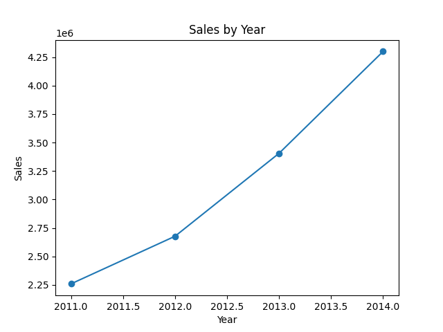
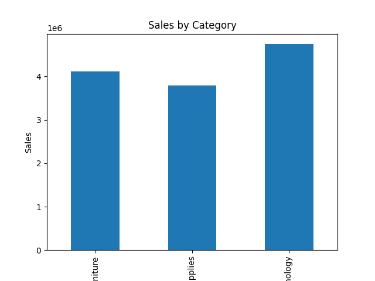
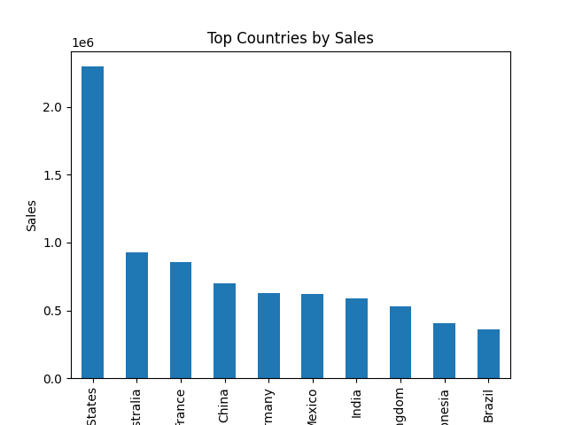
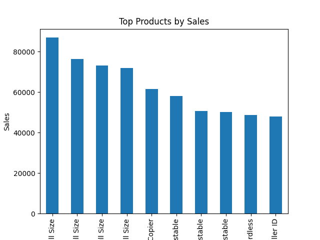

# 📊 Python SQL Sales Analysis

This project analyzes a retail sales dataset using **Python (Pandas, Matplotlib)** and **SQL** to extract insights about sales performance.

---

## 📂 Project Structure

```
python-sql-sales-analysis
│
├── Data
│   └ Global_Superstore2.csv
│
├── Python
│   └ analysis.py
│
├── SQL
│   └ query.sql
│
├── images
│   ├ sales_by_category.png
│   ├ sales_by_year.png
│   ├ top_countries.png
│   └ top_products.png
│
├── requirements.txt
│
└── README.md
```

---

## 📦 Dataset

The dataset used is **Global Superstore**, which contains information about:

- Orders  
- Sales  
- Profit  
- Customers  
- Countries  
- Product categories  

---

## 🛠 Technologies Used

- Python  
- Pandas  
- Matplotlib  
- SQL  

---

## 📈 Data Analysis

The Python script performs:

- Loading the dataset using Pandas  
- Aggregating sales and profit data  
- Identifying top countries by sales  
- Identifying top products  
- Creating visualizations using Matplotlib  

---

## 📊 Visualizations

### Sales by Year



### Sales by Category



### Top Countries by Sales



### Top Products by Sales



---

## 🧮 SQL Analysis

Example SQL queries used for analysis:

```sql
-- Total sales
SELECT SUM(Sales) AS total_sales
FROM superstore;

-- Total profit
SELECT SUM(Profit) AS total_profit
FROM superstore;

-- Sales by country
SELECT Country, SUM(Sales) AS total_sales
FROM superstore
GROUP BY Country
ORDER BY total_sales DESC;

-- Top products
SELECT "Product Name", SUM(Sales) AS total_sales
FROM superstore
GROUP BY "Product Name"
ORDER BY total_sales DESC
LIMIT 10;
```

---

## ⚙️ Installation

Clone the repository:

```
git clone https://github.com/your-username/python-sql-sales-analysis.git
```

Install dependencies:

```
pip install -r requirements.txt
```

Run the analysis:

```
python Python/analysis.py
```

---

## 👨‍💻 Author

Moussa Camara  
Student in Data / Python / SQL